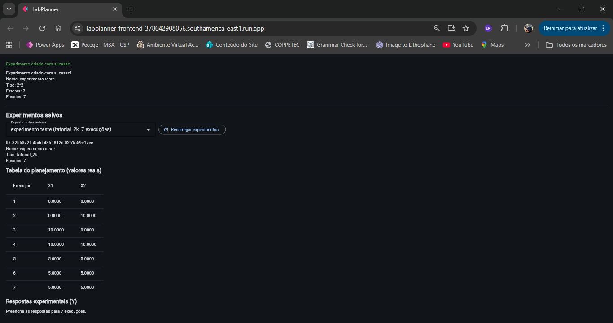
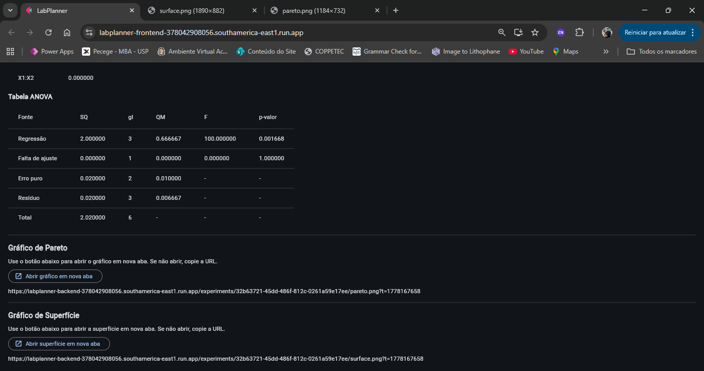

# LabPlanner – Planejamento Experimental em Nuvem

LabPlanner é uma aplicação web desenvolvida para auxiliar no planejamento e análise de experimentos utilizando técnicas de Design of Experiments (DOE).  

O sistema foi desenvolvido como parte de um Trabalho de Conclusão de Curso (TCC) em Engenharia de Software, utilizando arquitetura baseada em microsserviços, containers Docker e implantação em nuvem com Google Cloud Run.

---

# Aplicação Online

A aplicação está disponível publicamente em:

🔗 https://labplanner-frontend-378042908056.southamerica-east1.run.app

---

# Funcionalidades

- Planejamento fatorial 2ᵏ
- Planejamento fatorial 3ᵏ
- Planejamento fatorial fracionado
- Planejamento composto central (CCD)
- Planejamento Box-Behnken
- Definição de fatores e níveis experimentais
- Geração automática da matriz experimental
- Inserção de respostas experimentais
- Regressão linear dos efeitos
- Geração automática da tabela ANOVA
- Gráfico de Pareto dos efeitos
- Superfície de resposta
- Mapa de contorno
- Arquitetura distribuída em containers
- Execução local com Docker Compose
- Implantação em nuvem utilizando Google Cloud Run

---

# Arquitetura do Sistema

O sistema é dividido em três serviços principais:

```text
Frontend (Flet)
        ↓
Backend Core (FastAPI)
        ↓
DOE Service (FastAPI)
```

## Frontend
Responsável pela interface gráfica do usuário.

Funções:
- Entrada de parâmetros experimentais
- Exibição das tabelas
- Visualização de gráficos
- Comunicação com o backend via HTTP

Tecnologias:
- Python
- Flet

---

## Backend Core
Responsável pela lógica principal do sistema.

Funções:
- Gerenciamento dos experimentos
- Armazenamento de dados
- Regressão linear
- ANOVA
- Geração de gráficos

Tecnologias:
- FastAPI
- NumPy
- Pandas
- Statsmodels
- Matplotlib

---

## DOE Service
Microsserviço especializado na geração dos planejamentos experimentais.

Funções:
- Geração das matrizes DOE
- Conversão entre níveis codificados e reais
- Criação dos diferentes tipos de planejamento

Tecnologias:
- FastAPI
- Python

---

# Containers Docker

O projeto utiliza containers Docker independentes:

| Container | Responsabilidade |
|---|---|
| frontend_app | Interface do usuário |
| backend_core | Processamento principal |
| doe_service | Geração dos planejamentos |

Todos os serviços são orquestrados utilizando Docker Compose.

---

# Screenshots do Sistema

## Página inicial


---

## Geração do planejamento experimental



---

## Análise de regressão e ANOVA


---

## Gráfico de Pareto


---

## Superfície de resposta


---

## Interface dos gráficos



---

# Tecnologias Utilizadas

- Python
- FastAPI
- Flet
- Docker
- Docker Compose
- Google Cloud Run
- NumPy
- Pandas
- Matplotlib
- Statsmodels
- Pytest
- k6

---

# Execução Local

## 1. Clonar o repositório

```bash
git clone https://github.com/DaniellaVale/labplanner.git
```

---

## 2. Entrar na pasta do projeto

```bash
cd labplanner
```

---

## 3. Executar os containers

```bash
docker-compose up --build
```

---

# Endpoints Principais

| Endpoint | Função |
|---|---|
| `/experiments` | Criação de experimentos |
| `/analysis` | Regressão e ANOVA |
| `/pareto.png` | Gráfico de Pareto |
| `/surface.png` | Superfície de resposta |

---

# Testes de Desempenho

O sistema foi submetido a testes de carga utilizando k6.

Métricas avaliadas:
- Latência média
- Percentil 95 (P95)
- Throughput
- Taxa de erro

Resultados observados:
- ~161 requisições por segundo
- Taxa de erro de 0%
- Capacidade de processamento concorrente sob carga

---

# Estrutura do Projeto

```text
labplanner/
│
├── backend_core/
├── doe_service/
├── frontend_app/
├── tests/
├── docs/
│   └── images/
├── docker-compose.yml
├── load_test.js
├── README.md
└── LICENSE
```

---

# Licença

Este projeto está licenciado sob a licença MIT.

Consulte o arquivo:

```text
LICENSE
```

---

# Autora

Daniella Vale  
Instituto de Química – UFRJ  
Engenharia de Software – MBA USP

---

# Observações

Este projeto possui finalidade acadêmica e científica, sendo utilizado como plataforma de apoio ao planejamento experimental e ensino de Design of Experiments (DOE).