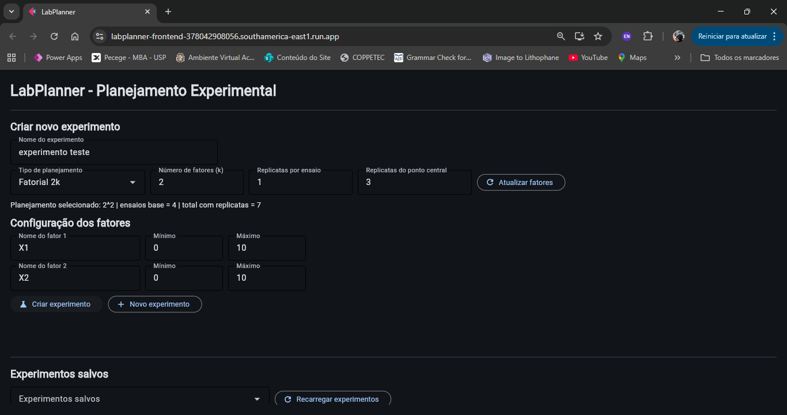
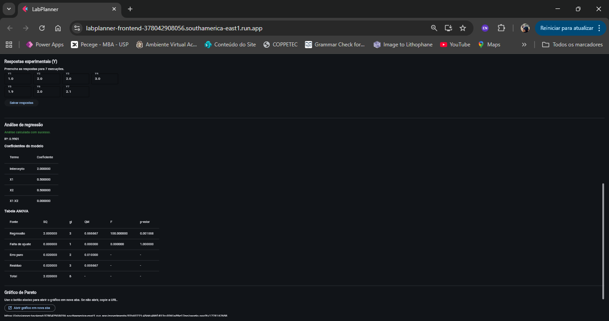
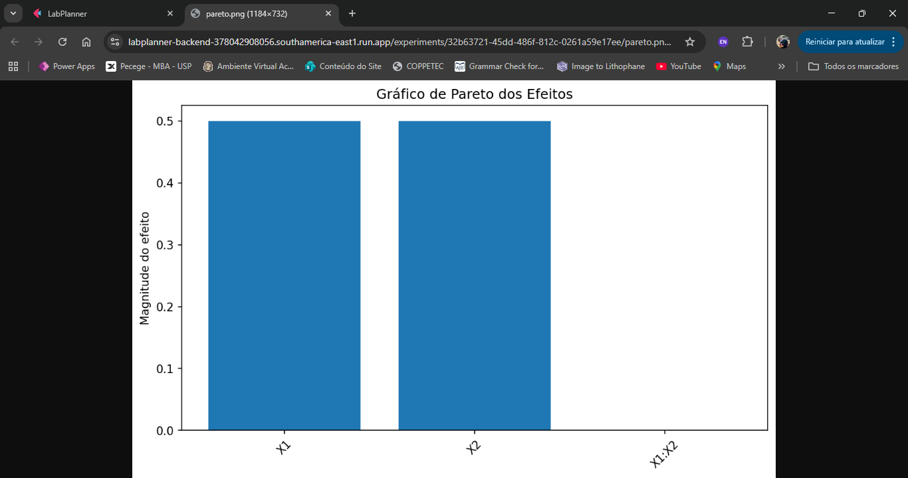
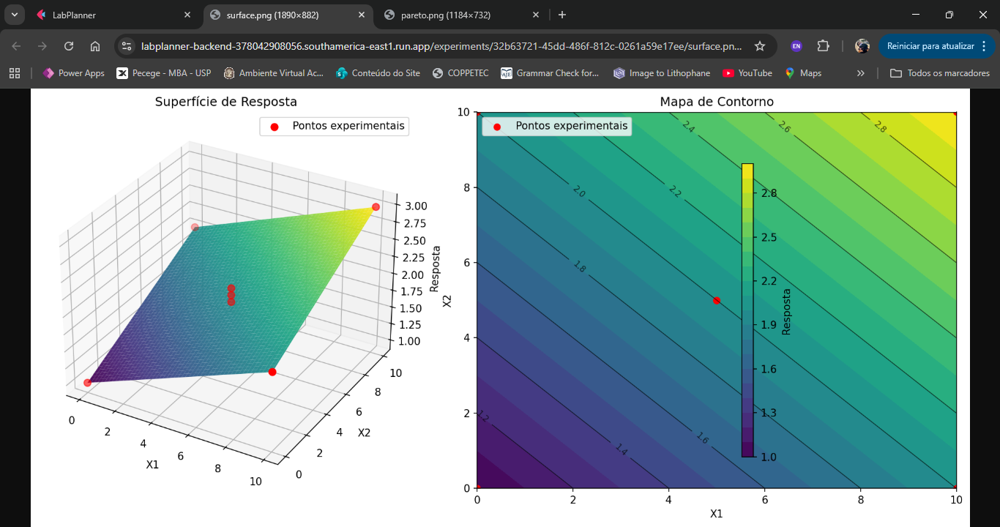

# LabPlanner

LabPlanner is a cloud-native web application for Design of Experiments (DOE), developed using FastAPI, Flet, Docker and Google Cloud Run.

## Features

- Factorial design generation (2^k)
- Experimental matrix generation
- Statistical regression analysis
- ANOVA table
- Pareto charts
- Response surface plots
- Cloud-native architecture
- Microservices deployment
- Automated testing (TDD)

---

## Architecture

- Frontend: Flet
- Backend: FastAPI
- DOE Service: Dedicated microservice
- Containers: Docker
- Deployment: Google Cloud Run

---

## Live Application

Frontend:
https://labplanner-frontend-378042908056.southamerica-east1.run.app

GitHub Repository:
https://github.com/DaniellaVale/labplanner

---

# System Screenshots

## Main interface

---

## Experimental matrix

---

## Regression analysis and ANOVA

---

## Pareto chart

---

## Response surface and contour plot

---

## Technologies Used

- Python
- FastAPI
- Flet
- Docker
- Google Cloud Run
- Pytest
- Matplotlib
- NumPy
- Pandas
- Scikit-learn
- Statsmodels

---

## Author

Daniella Vale